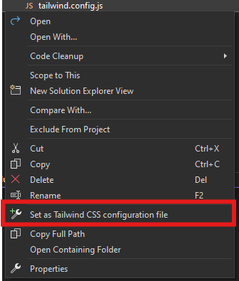
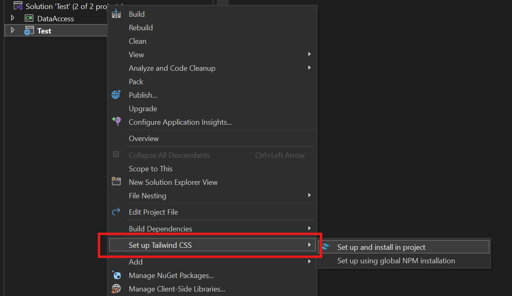
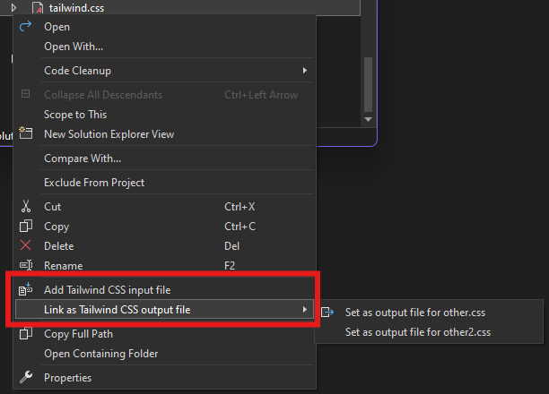
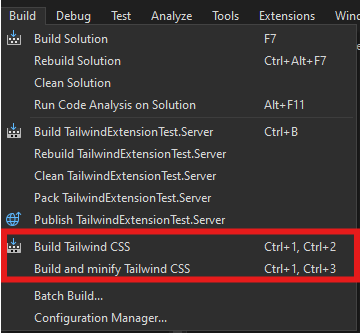

# Getting Started

## Video

If you prefer a video tutorial, [click here](https://www.youtube.com/watch?v=guJgtQHQwPo) to watch CodingWithGreg's YouTube video.

## Installation

1. Download from the [Visual Studio Marketplace](https://marketplace.visualstudio.com/items?itemName=TheronWang.TailwindCSSIntellisense) or directly from the IDE.

	- If you are downloading from the IDE, open Extensions > Manage Extensions and search up 'Tailwind'.

	

	**IMPORTANT**: This extension uses `npm` and `node` for various purposes--follow the [official guide](https://docs.npmjs.com/downloading-and-installing-node-js-and-npm) if you do not already have it installed.

## Existing Projects

2. The extension will automatically try to find a `tailwind.config.js` in your solution. If it is not found, however, you can manually set it by **right-clicking your file and selecting 'Set as Tailwind CSS configuration file'**.

	**Extension features will only be enabled if a configuration file is found.**

	

## New Project

2a.	Once you have created a project, **right click on the project node and click 'Set up and install Tailwind CSS'**:



This will import the Tailwind CSS node modules and configure your `tailwind.config.js`.

**Using the standalone Tailwind CSS CLI:**
- If you have the Tailwind CSS CLI installed, you can click 'Set up Tailwind CSS (use CLI)' instead once you have specified the CLI path in Tools > Options > Tailwind CSS IntelliSense > Tailwind CLI path.
- Following builds in the project will use the Tailwind CLI instead of `npx tailwindcss`
- If you want to switch between `npx tailwindcss` and the standalone CLI, adjust the `UseCli` property in `tailwind.extension.json`

2b. To configure Tailwind CSS, follow the [official documentation](https://tailwindcss.com/docs/installation) (specifically steps 2, 3, and 5).

- Include the following in your input css file:
```css
@tailwind base;
@tailwind components;
@tailwind utilities;
```
- Ensure your `tailwind.config.js` has a valid `content` value (e.g. `["./**/*.{html,cshtml,razor,js}"]`)

## Setting Up the Extension

3. Before you are ready to build, **set your input CSS file**. Your output file will automatically be generated as `{input file name}.output.css`. If you want to specify a certain file, you can right click and click 'Link as Tailwind CSS output file' and select the corresponding input file. **Input files must already be defined prior to selecting an output file.**



4. IntelliSense will display once you type in any HTML or CSS files, including `.html`, `.css`, `.cshtml`, `.razor` files and more, **as long as there is either a `tailwind.config.js` file or another configuration file specified**.


5. **Your Tailwind file will automatically build on project build**, but you can also manually start the build process under Build > Build Tailwind CSS.



6. **Settings for this extension can be updated in Tools > Options > Tailwind CSS IntelliSense.**

7. Custom regexes can be defined in settings. **Please note that:**
- There can only be one, valid C# regex.
- Your class content must be located in the `content` capture group. For example, the regex `class="(?<content>.*)"` successfully captures `content`.
- Custom regexes take precedence over default functionality; that is, if a context is matched in both your custom regex and the original regex, the custom regex will be used.
- It's recommended to thoroughly test your regexes before adding it into your options. Unintended behavior may occur if the regex is too general or if it overlaps with existing functionality.